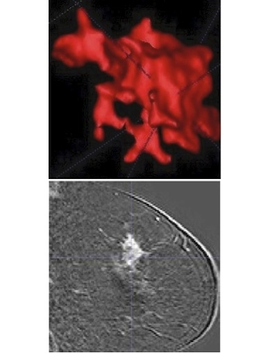

## (Coming) Estimating illumination for Augmented Reality on deformable objects
In this project, we track the deformable objects in real-time and at the same time estimate the irradiance map of the environment. We can use this irradiance map to realistically illuminate virtual objects using a piece of OpenGL shading script.

<figure class="half">
    
    
    <figcaption>*Irradiance map estimation* Left: Input image with augmented contents. Right: Environment irradiance map.</figcaption>
</figure>

<figure class="half">
    
    
    <figcaption>*Irradiance map estimation* Left: Input image in another settings. Right: Environment irradiance map.</figcaption>
</figure>

## Augmented reality coloring book iOS App
Developed the first real-time highly optimized 3-D deformable surface tracking system on mobile devices for an augmented reality children coloring book application.

<iframe width="560" height="315" src="https://www.youtube.com/embed/IeHKVC0XLe4" frameborder="0" allowfullscreen> </iframe>

## Deformable surface tracking and reconstruction from videos
Study to develop a fast 3-D deformable surface tracking system, to develop simultaneous dense image alignment and 3-D deformable shape reconstruction in presence of occlusions and low texture (in C++/Qt and Matlab).

<iframe width="560" height="315" src="https://www.youtube.com/embed/t2vqsitWLKs" frameborder="0" allowfullscreen> </iframe>  

<iframe width="560" height="315" src="https://www.youtube.com/embed/gW3OnO33iyE" frameborder="0" allowfullscreen> </iframe>  

<iframe width="420" height="315" src="https://www.youtube.com/embed/CEhsiqFsnAM" frameborder="0" allowfullscreen> </iframe> 

## Model-based tracking of rigid objects
Simulate a rocket taking off by moving the camera down. Track the pose of the rocket with respect to the camera over time. The tracking is performed by using an edge-based method.

<iframe width="420" height="315" src="https://www.youtube.com/embed/PB3qy2ltrCg" frameborder="0" allowfullscreen> </iframe> 

Tracking small objects (a pen in the following video) with little image information using a global method that exploits most image information.

<iframe width="560" height="215" src="https://www.youtube.com/embed/GKYUpx3Nr7k" frameborder="0" allowfullscreen></iframe> 

## Kinect-external high resolution RGB camera calibration
Accquiring depth and RGB images using a Microsoft Kinect limits the resolution of the RGB camera to 640x480. For the purpose of obtaining high resolution RGB images for another computer vision algorithm, I attach a high resolution RGB camera next to the Kinect and calibrate this system. The calibration computes the relative pose between the external RGB camera and the depth sensor (i.e. IR camera). The calibration also computes a more accurate mapping from raw disparity to actual depth than the built-in mapping.

<figure class="third">
    
    
    
    <figcaption>*Kinect & external camera calibration* Left: Kinect RGB camera image. Middle: Kinect Infrared camera image. Right: RGB high resolution camera image.</figcaption>    
</figure>

 
Using this calibrated system, we can obtain a 3D point cloud and a high resolution texture used for 3D model accquisition. 

<figure class="third">
    
    
    
    <figcaption>*Build a high quality textured model of a cushion*</figcaption>
</figure>

## Gaze-Tracking
Successfully built a low cost gaze-tracking system, which enables users to use their eyes to control how PDF documents are presented (in C++/CLI).

<iframe width="420" height="315" src="https://www.youtube.com/embed/-2TwwEfxaLE" frameborder="0" allowfullscreen> </iframe>

## Diagnosing breast cancer with pattern recognition techniques
Study and evaluate state-of-the-art techniques to segmentation, shape description, temporal enhancement description, and classification of MRI non-mass breast lesions for a computer-aided diagnosis system (in Matlab).

<figure class="half">
    
    
    <figcaption>*Breast tumor classification* Left: Benign - ductal and papillary hyperplasia. Right: Malignant - invasive ductal carcinoma.</figcaption>    
</figure>

## Integrated model for Vietnamese text recognition
Developed a complete, efficient, one of the first recognition systems for Vietnamese printed text by using advanced image processing techniques, well-designed feature extractions, multi–layer classifier with character grouping, in combination with Hidden Markov Model and language model (in C#).

<iframe width="420" height="315" src="https://www.youtube.com/embed/PGFpQO9wn8w" frameborder="0" allowfullscreen> </iframe>